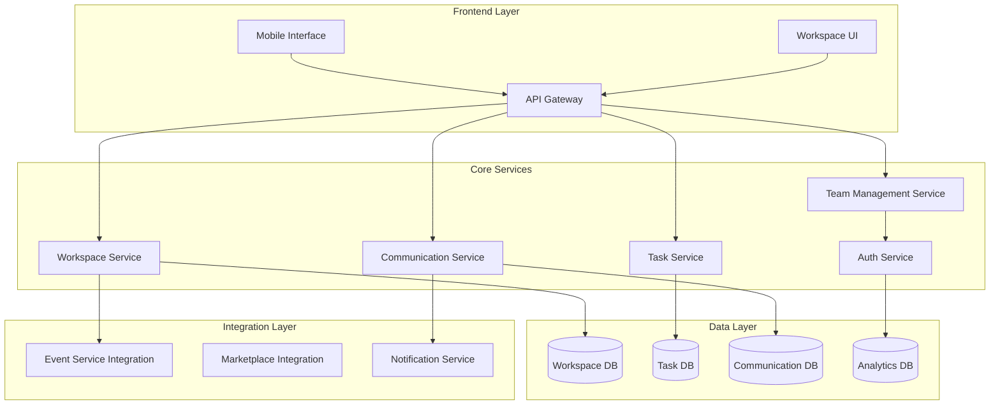

# Event Community Workspace Design Document

## Overview

The Event Community Workspace is a comprehensive team collaboration and project management system integrated within Thittam1Hub. It transforms event management from individual organizer activities into collaborative team efforts by providing temporary, event-specific workspaces with role-based access controls, task management, resource sharing, and integrated communication tools.

The system follows a lifecycle-based approach where workspaces are automatically provisioned when events are created, actively support collaboration during event preparation and execution, and are systematically dissolved after event completion. This ensures security, data isolation, and proper resource management while enabling effective team coordination.

## Architecture

### High-Level Architecture

The Event Community Workspace follows a modular, service-oriented architecture that integrates seamlessly with existing Thittam1Hub components:



### Service Architecture

**Workspace Service**: Core orchestration service managing workspace lifecycle, provisioning, and dissolution
**Team Management Service**: Handles invitations, role assignments, access control, and team member lifecycle
**Task Service**: Manages task creation, assignment, dependencies, progress tracking, and templates
**Communication Service**: Provides messaging, notifications, and collaboration tools
**Analytics Service**: Generates insights, reports, and performance metrics

## Components and Interfaces

### Core Components

#### Workspace Manager
- **Purpose**: Central orchestrator for workspace lifecycle management
- **Responsibilities**: 
  - Workspace provisioning and dissolution
  - Integration with event lifecycle
  - Template management
  - Security policy enforcement
- **Key Methods**:
  - `provisionWorkspace(eventId: string, organizerId: string): Workspace`
  - `dissolveWorkspace(workspaceId: string, retentionPeriod: number): void`
  - `applyTemplate(workspaceId: string, templateId: string): void`

#### Team Manager
- **Purpose**: Manages team composition, roles, and access control
- **Responsibilities**:
  - Team member invitation and onboarding
  - Role-based access control (RBAC)
  - Permission management
  - Audit trail maintenance
- **Key Methods**:
  - `inviteTeamMember(workspaceId: string, email: string, role: WorkspaceRole): Invitation`
  - `assignRole(memberId: string, role: WorkspaceRole): void`
  - `revokeAccess(memberId: string): void`

#### Task Engine
- **Purpose**: Comprehensive task management and workflow orchestration
- **Responsibilities**:
  - Task creation and assignment
  - Dependency management
  - Progress tracking
  - Template system
- **Key Methods**:
  - `createTask(task: TaskDefinition): Task`
  - `assignTask(taskId: string, assigneeId: string): void`
  - `updateProgress(taskId: string, status: TaskStatus, progress: number): void`

#### Communication Hub
- **Purpose**: Integrated communication and collaboration platform
- **Responsibilities**:
  - Message routing and delivery
  - Channel management
  - Notification orchestration
  - File sharing coordination
- **Key Methods**:
  - `sendMessage(channelId: string, message: Message): void`
  - `createChannel(workspaceId: string, channelType: ChannelType): Channel`
  - `broadcastAnnouncement(workspaceId: string, announcement: Announcement): void`

### Integration Interfaces

#### Event Service Integration
```typescript
interface EventIntegration {
  onEventCreated(event: Event): Promise<Workspace>
  onEventUpdated(event: Event): Promise<void>
  onEventCompleted(event: Event): Promise<void>
  syncMilestones(workspaceId: string, milestones: Milestone[]): Promise<void>
}
```

#### Marketplace Integration
```typescript
interface MarketplaceIntegration {
  findTeamServices(criteria: ServiceCriteria): Promise<MarketplaceService[]>
  hireTeamMember(serviceId: string, workspaceId: string): Promise<TeamMember>
  integrateExternalMember(member: ExternalMember): Promise<void>
}
```

## Data Models

### Core Entities

#### Workspace
```typescript
interface Workspace {
  id: string
  eventId: string
  ownerId: string
  name: string
  description: string
  status: WorkspaceStatus
  settings: WorkspaceSettings
  createdAt: Date
  dissolvedAt?: Date
  templateId?: string
}

enum WorkspaceStatus {
  PROVISIONING = 'provisioning',
  ACTIVE = 'active',
  WINDING_DOWN = 'winding_down',
  DISSOLVED = 'dissolved'
}
```

#### Team Member
```typescript
interface TeamMember {
  id: string
  workspaceId: string
  userId: string
  role: WorkspaceRole
  permissions: Permission[]
  joinedAt: Date
  leftAt?: Date
  invitedBy: string
  status: MemberStatus
}

enum WorkspaceRole {
  WORKSPACE_OWNER = 'workspace_owner',
  TEAM_LEAD = 'team_lead',
  EVENT_COORDINATOR = 'event_coordinator',
  VOLUNTEER_MANAGER = 'volunteer_manager',
  TECHNICAL_SPECIALIST = 'technical_specialist',
  MARKETING_LEAD = 'marketing_lead',
  GENERAL_VOLUNTEER = 'general_volunteer'
}
```

#### Task
```typescript
interface Task {
  id: string
  workspaceId: string
  title: string
  description: string
  assigneeId: string
  creatorId: string
  category: TaskCategory
  priority: TaskPriority
  status: TaskStatus
  progress: number
  dueDate: Date
  dependencies: string[]
  tags: string[]
  createdAt: Date
  updatedAt: Date
}

enum TaskStatus {
  NOT_STARTED = 'not_started',
  IN_PROGRESS = 'in_progress',
  REVIEW_REQUIRED = 'review_required',
  COMPLETED = 'completed',
  BLOCKED = 'blocked'
}
```

#### Communication Channel
```typescript
interface Channel {
  id: string
  workspaceId: string
  name: string
  type: ChannelType
  description: string
  members: string[]
  isPrivate: boolean
  createdAt: Date
}

enum ChannelType {
  GENERAL = 'general',
  TASK_SPECIFIC = 'task_specific',
  ROLE_BASED = 'role_based',
  ANNOUNCEMENT = 'announcement'
}
```
## Correctness Properties

*A property is a characteristic or behavior that should hold true across all valid executions of a system-essentially, a formal statement about what the system should do. Properties serve as the bridge between human-readable specifications and machine-verifiable correctness guarantees.*

### Property Reflection

After analyzing all acceptance criteria, several properties can be consolidated to eliminate redundancy:

- **Workspace Lifecycle Properties**: Properties 1.1, 1.2, 10.1, 10.2, 10.3 can be combined into comprehensive lifecycle management properties
- **Access Control Properties**: Properties 6.1, 6.2, 6.5, 15.1, 15.3 can be consolidated into comprehensive access control validation
- **Task Management Properties**: Properties 4.1, 4.2, 4.4, 5.1 can be combined into comprehensive task lifecycle properties
- **Integration Properties**: Properties 9.1, 9.2, 9.3, 9.5, 13.1-13.5 can be consolidated into comprehensive integration validation

### Core Properties

**Property 1: Workspace Provisioning and Lifecycle**
*For any* event creation, the system should automatically provision a workspace, assign the organizer as owner with full privileges, generate unique identifiers, initialize default settings, and ensure complete data isolation from other workspaces
**Validates: Requirements 1.1, 1.2, 1.3, 1.4, 1.5**

**Property 2: Team Member Invitation Round Trip**
*For any* team invitation workflow, sending an invitation should generate secure links with context, display complete information to recipients, grant correct access upon acceptance, update team rosters, and notify existing members
**Validates: Requirements 2.1, 2.2, 2.3, 2.4**

**Property 3: Role-Based Access Control Consistency**
*For any* role assignment or update, the system should immediately apply correct permissions, maintain audit trails, prevent unauthorized access to other workspaces, and enforce role-specific data access restrictions
**Validates: Requirements 3.2, 3.3, 3.4, 6.1, 6.2, 6.5**

**Property 4: Task Lifecycle Management**
*For any* task creation, assignment, or update, the system should enforce required fields, send appropriate notifications, maintain progress tracking with timestamps, enforce dependencies, and support all defined status transitions
**Validates: Requirements 4.1, 4.2, 4.4, 5.1, 5.4**

**Property 5: Communication Integration**
*For any* workspace communication, the system should provide organized channels, support broadcast messaging, maintain searchable history, enable priority notifications, and integrate with task management
**Validates: Requirements 7.1, 7.2, 7.3, 7.4, 7.5**

**Property 6: Dashboard and Analytics Completeness**
*For any* workspace dashboard access, the system should display task completion rates, activity levels, upcoming deadlines, performance metrics, health indicators, and resource allocation insights
**Validates: Requirements 8.1, 8.2, 8.3, 8.4**

**Property 7: Event-Workspace Synchronization**
*For any* event or workspace change, the system should maintain bidirectional synchronization, align task deadlines with milestones, propagate updates appropriately, and escalate priorities for critical deadlines
**Validates: Requirements 9.1, 9.2, 9.3, 9.4, 9.5**

**Property 8: Access Lifecycle Management**
*For any* workspace lifecycle transition, the system should properly manage access modes, initiate wind-down procedures, revoke access while preserving audit data, handle early departures, and support emergency revocation
**Validates: Requirements 10.1, 10.2, 10.3, 10.4, 10.5**

**Property 9: Template System Consistency**
*For any* template creation or application, the system should save successful workspace structures, offer appropriate templates for new events, customize based on requirements, track effectiveness, and support organization-level sharing
**Validates: Requirements 11.1, 11.2, 11.3, 11.4, 11.5**

**Property 10: Mobile Platform Parity**
*For any* mobile workspace access, the system should provide responsive interfaces, send push notifications, support offline functionality with synchronization, integrate GPS for location tasks, and enable mobile-specific features
**Validates: Requirements 12.1, 12.2, 12.3, 12.4, 12.5**

**Property 11: System Integration Harmony**
*For any* workspace activity involving existing Thittam1Hub features, the system should integrate seamlessly with registration, logistics, communications, analytics, and other systems without creating conflicts
**Validates: Requirements 13.1, 13.2, 13.3, 13.4, 13.5**

**Property 12: Marketplace Integration Transparency**
*For any* marketplace team building, the system should recommend appropriate vendors, automatically integrate hired members, provide seamless tools for mixed teams, support different access levels, and maintain clear separation while enabling collaboration
**Validates: Requirements 14.1, 14.2, 14.3, 14.4, 14.5**

**Property 13: Security and Compliance Enforcement**
*For any* workspace operation, the system should enforce encryption, maintain comprehensive audit logs, ensure privacy regulation compliance, provide incident response capabilities, and support configurable security policies
**Validates: Requirements 15.1, 15.2, 15.3, 15.4, 15.5**

## Error Handling

### Error Categories

#### Workspace Lifecycle Errors
- **Provisioning Failures**: Handle event service unavailability, database constraints, template application errors
- **Dissolution Errors**: Manage incomplete wind-down, audit log preservation failures, access revocation issues

#### Access Control Errors
- **Authentication Failures**: Invalid tokens, expired sessions, unauthorized access attempts
- **Authorization Errors**: Insufficient permissions, role assignment conflicts, cross-workspace access attempts
- **Invitation Errors**: Invalid email addresses, duplicate invitations, expired invitation links

#### Task Management Errors
- **Validation Errors**: Missing required fields, invalid date ranges, circular dependencies
- **Assignment Errors**: Invalid assignees, role permission mismatches, capacity overruns
- **Synchronization Errors**: Event timeline conflicts, milestone alignment failures, dependency violations

#### Communication Errors
- **Delivery Failures**: Notification service outages, invalid recipient addresses, message size limits
- **Channel Errors**: Permission conflicts, invalid channel configurations, message history corruption

#### Integration Errors
- **External Service Failures**: Marketplace API unavailability, event service timeouts, notification delivery failures
- **Data Synchronization Errors**: Conflicting updates, version mismatches, transformation failures

### Error Handling Strategies

#### Graceful Degradation
- Continue core functionality when non-critical services fail
- Provide offline capabilities for mobile users
- Cache critical data for service interruptions

#### Retry Mechanisms
- Exponential backoff for transient failures
- Circuit breaker patterns for external service calls
- Dead letter queues for failed message delivery

#### User Communication
- Clear error messages with actionable guidance
- Progress indicators for long-running operations
- Fallback options when primary features are unavailable

#### Data Integrity
- Transaction rollback for failed multi-step operations
- Audit trail preservation even during error conditions
- Consistency checks and automatic repair mechanisms

## Testing Strategy

### Dual Testing Approach

The Event Community Workspace requires both unit testing and property-based testing to ensure comprehensive correctness validation:

- **Unit tests** verify specific examples, edge cases, and error conditions
- **Property tests** verify universal properties that should hold across all inputs
- Together they provide comprehensive coverage: unit tests catch concrete bugs, property tests verify general correctness

### Property-Based Testing Framework

**Framework Selection**: We will use **fast-check** for TypeScript/JavaScript property-based testing, which provides excellent support for complex object generation and property verification.

**Configuration Requirements**:
- Each property-based test MUST run a minimum of 100 iterations
- Each property-based test MUST be tagged with a comment explicitly referencing the correctness property from this design document
- Tag format: `**Feature: event-community-workspace, Property {number}: {property_text}**`
- Each correctness property MUST be implemented by a SINGLE property-based test

### Unit Testing Strategy

**Unit Test Coverage**:
- Workspace lifecycle management (provisioning, dissolution, state transitions)
- Role-based access control validation
- Task dependency resolution and enforcement
- Communication channel management
- Integration point validation
- Error handling and recovery scenarios

**Test Organization**:
- Co-locate tests with source files using `.test.ts` suffix
- Group related functionality in test suites
- Use descriptive test names that explain the specific behavior being tested

### Integration Testing

**Integration Points**:
- Event service integration for workspace lifecycle
- Marketplace integration for team member hiring
- Notification service integration for communications
- Authentication service integration for access control

**Test Scenarios**:
- End-to-end workspace creation and team collaboration workflows
- Cross-service data synchronization validation
- Error propagation and recovery across service boundaries
- Performance testing under realistic load conditions

### Testing Data Management

**Test Data Strategy**:
- Generate realistic test data using factories and builders
- Use property-based testing generators for comprehensive input coverage
- Maintain test data isolation between test runs
- Clean up test workspaces and associated data after test completion

**Property Test Generators**:
- Smart generators that constrain to valid input spaces
- Workspace configuration generators with realistic role distributions
- Task dependency generators that avoid circular references
- Event timeline generators with proper milestone sequencing