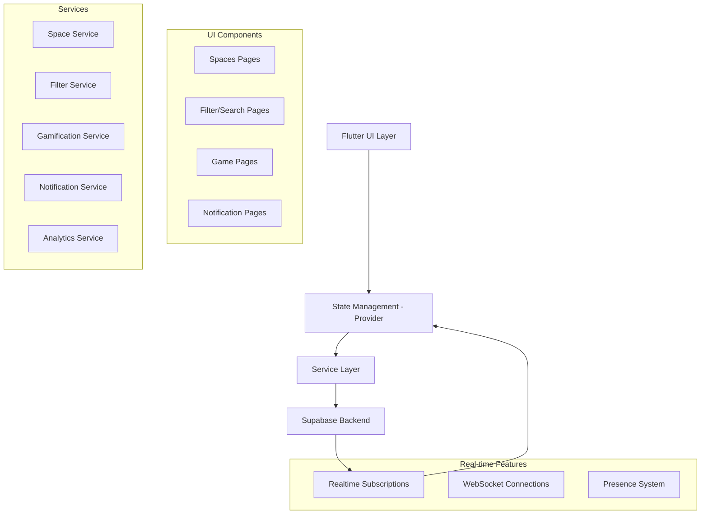

# Design Document: Impact Hub Enhancements

## Overview

This design document outlines the technical implementation for comprehensive Impact Hub enhancements, focusing on real-time audio room management, advanced search capabilities, gamification tracking, and social engagement features. The solution leverages Flutter's Provider state management, Supabase real-time subscriptions, and optimized UI patterns to create a responsive and engaging community platform.

## Architecture

### High-Level Architecture



### State Management Strategy

The application uses Provider pattern for state management with the following hierarchy:

- **Global Providers**: Authentication, Theme, Notifications
- **Feature Providers**: SpaceProvider, FilterProvider, GameProvider
- **Local State**: Widget-specific state using StatefulWidget where appropriate

## Components and Interfaces

### 1. Enhanced Space Management System

#### SpaceProvider
```dart
class SpaceProvider extends ChangeNotifier {
  final SpaceService _spaceService;
  final List<Space> _liveSpaces = [];
  final Map<String, List<HandRaise>> _handRaiseQueues = {};
  final Map<String, SpaceParticipants> _participants = {};
  
  // Host Controls
  Future<void> muteAllSpeakers(String spaceId);
  Future<void> endSpace(String spaceId);
  Future<void> removeSpeaker(String spaceId, String userId);
  
  // Hand Raise Management
  Future<void> raiseHand(String spaceId);
  Future<void> approveHandRaise(String spaceId, String userId);
  Future<void> denyHandRaise(String spaceId, String userId);
  
  // Real-time Updates
  void _subscribeToSpaceUpdates(String spaceId);
  void _handleHandRaiseUpdate(Map<String, dynamic> payload);
}
```

#### Enhanced SpaceService
```dart
class SpaceService extends SupabaseService {
  // Hand-raise operations
  Future<void> raiseHand(String spaceId) async {
    await client.from('space_hand_raises').insert({
      'space_id': spaceId,
      'user_id': getCurrentUserId(),
      'raised_at': DateTime.now().toIso8601String(),
    });
  }
  
  // Host control operations
  Future<void> muteAllSpeakers(String spaceId) async {
    await client.from('space_speakers')
      .update({'is_muted': true})
      .eq('space_id', spaceId)
      .neq('user_id', getCurrentUserId()); // Don't mute host
  }
  
  // Real-time subscriptions
  Stream<List<HandRaise>> getHandRaiseStream(String spaceId) {
    return client.from('space_hand_raises')
      .stream(primaryKey: ['id'])
      .eq('space_id', spaceId)
      .order('raised_at')
      .map((data) => data.map((item) => HandRaise.fromJson(item)).toList());
  }
}
```

### 2. Comprehensive Search and Filter System

#### FilterProvider
```dart
class FilterProvider extends ChangeNotifier {
  final FilterService _filterService;
  Timer? _debounceTimer;
  
  // Search state
  String _searchQuery = '';
  Map<String, dynamic> _activeFilters = {};
  bool _isSearching = false;
  
  // Debounced search implementation
  void updateSearchQuery(String query) {
    _searchQuery = query;
    _debounceTimer?.cancel();
    _debounceTimer = Timer(Duration(milliseconds: 300), () {
      _performSearch();
    });
  }
  
  // Filter management
  void addFilter(String key, dynamic value);
  void removeFilter(String key);
  void clearAllFilters();
  
  // Search execution
  Future<void> _performSearch();
}
```

#### FilterService
```dart
class FilterService extends SupabaseService {
  // Pulse profile search
  Future<List<ImpactProfile>> searchProfiles({
    String? query,
    List<String>? skills,
    List<String>? interests,
    List<String>? lookingFor,
  }) async {
    var queryBuilder = client.from('impact_profiles').select();
    
    if (query?.isNotEmpty == true) {
      queryBuilder = queryBuilder.or(
        'full_name.ilike.%$query%,'
        'headline.ilike.%$query%,'
        'organization.ilike.%$query%'
      );
    }
    
    if (skills?.isNotEmpty == true) {
      queryBuilder = queryBuilder.overlaps('skills', skills);
    }
    
    // Additional filter logic...
    return _executeSearch(queryBuilder);
  }
  
  // Circle search with full-text search
  Future<List<Circle>> searchCircles({
    String? query,
    List<String>? tags,
    String? category,
  }) async {
    // Implementation with PostgreSQL full-text search
  }
}
```

### 3. Gamification and Analytics System

#### GameProvider
```dart
class GameProvider extends ChangeNotifier {
  final GamificationService _gamificationService;
  
  // Game state
  List<GameHistory> _gameHistory = [];
  UserStats? _userStats;
  List<Achievement> _achievements = [];
  
  // Game completion tracking
  Future<void> completeGame(String gameId, int score) async {
    await _gamificationService.recordGameCompletion(gameId, score);
    await _updateUserStats();
    await _checkForNewAchievements();
    notifyListeners();
  }
  
  // Analytics
  Future<UserAnalytics> getUserAnalytics() async {
    return await _gamificationService.calculateUserAnalytics();
  }
}
```

#### Enhanced GamificationService
```dart
class GamificationService extends SupabaseService {
  // Game completion tracking
  Future<void> recordGameCompletion(String gameId, int score) async {
    await client.from('game_completions').insert({
      'user_id': getCurrentUserId(),
      'game_id': gameId,
      'score': score,
      'completed_at': DateTime.now().toIso8601String(),
    });
    
    // Update user stats
    await _updateUserPoints(score);
    await _checkLevelProgression();
  }
  
  // Analytics calculation
  Future<UserAnalytics> calculateUserAnalytics() async {
    // Complex analytics queries
    final results = await client.rpc('calculate_user_analytics', {
      'user_id': getCurrentUserId(),
    });
    
    return UserAnalytics.fromJson(results);
  }
}
```

### 4. Real-time Notification System

#### NotificationProvider
```dart
class NotificationProvider extends ChangeNotifier {
  final NotificationService _notificationService;
  final List<NotificationItem> _notifications = [];
  int _unreadCount = 0;
  
  // Real-time notification handling
  void _subscribeToNotifications() {
    _notificationService.getNotificationStream().listen((notification) {
      _notifications.insert(0, notification);
      _unreadCount++;
      _showInAppNotification(notification);
      notifyListeners();
    });
  }
  
  // In-app notification display
  void _showInAppNotification(NotificationItem notification) {
    // Show overlay notification with custom animation
  }
}
```

## Data Models

### Enhanced Models

#### HandRaise Model
```dart
class HandRaise {
  final String id;
  final String spaceId;
  final String userId;
  final String userFullName;
  final String? userAvatarUrl;
  final DateTime raisedAt;
  final HandRaiseStatus status;
  
  const HandRaise({
    required this.id,
    required this.spaceId,
    required this.userId,
    required this.userFullName,
    this.userAvatarUrl,
    required this.raisedAt,
    required this.status,
  });
}

enum HandRaiseStatus { pending, approved, denied }
```

#### GameHistory Model
```dart
class GameHistory {
  final String id;
  final String gameId;
  final String gameType;
  final int score;
  final int pointsEarned;
  final DateTime completedAt;
  final Map<String, dynamic>? gameData;
  
  const GameHistory({
    required this.id,
    required this.gameId,
    required this.gameType,
    required this.score,
    required this.pointsEarned,
    required this.completedAt,
    this.gameData,
  });
}
```

#### UserAnalytics Model
```dart
class UserAnalytics {
  final int totalConnections;
  final int connectionGrowthRate;
  final int sparkPostViews;
  final int sparkPostEngagement;
  final int circleParticipation;
  final int spaceAttendance;
  final double communityImpactScore;
  final List<String> topInterestAreas;
  final Map<String, int> weeklyActivity;
  
  const UserAnalytics({
    required this.totalConnections,
    required this.connectionGrowthRate,
    required this.sparkPostViews,
    required this.sparkPostEngagement,
    required this.circleParticipation,
    required this.spaceAttendance,
    required this.communityImpactScore,
    required this.topInterestAreas,
    required this.weeklyActivity,
  });
}
```

Now I need to use the prework tool to analyze the acceptance criteria before writing the correctness properties section.

## Correctness Properties

*A property is a characteristic or behavior that should hold true across all valid executions of a system-essentially, a formal statement about what the system should do. Properties serve as the bridge between human-readable specifications and machine-verifiable correctness guarantees.*

### Property 1: Host Control Consistency
*For any* space and any host action (mute all, end space, remove speaker), the system should execute the action for all applicable participants and maintain consistent state across all clients.
**Validates: Requirements 1.2, 1.3, 1.5**

### Property 2: Hand-Raise Queue Management
*For any* space with hand-raises, the queue should maintain chronological order, and any queue operation (raise, approve, deny, lower) should update the queue state correctly and notify relevant participants.
**Validates: Requirements 2.1, 2.2, 2.3, 2.4, 2.5, 2.6**

### Property 3: Search Filter Consistency
*For any* search query and filter combination across any Impact Hub section, the results should only include items that match all applied criteria using AND logic, and clearing filters should restore the complete unfiltered dataset.
**Validates: Requirements 3.1, 3.2, 3.3, 3.4, 3.5, 3.6, 3.7**

### Property 4: Game Completion Tracking
*For any* completed game, the system should record all completion data (timestamp, score, points) and update user statistics (total points, level, badges) consistently.
**Validates: Requirements 4.1, 4.2, 4.3, 4.4, 4.5, 4.6**

### Property 5: Online Status Synchronization
*For any* user status change (active, inactive, offline), the system should update the status across all contexts (profiles, circles, spaces) within the specified time limits and display consistent indicators.
**Validates: Requirements 5.1, 5.2, 5.3, 5.4, 5.5, 5.6**

### Property 6: Real-time Notification Delivery
*For any* user interaction that triggers a notification (connection request, mention, space live, post interaction, badge earned, speaker promotion), the system should deliver the notification immediately with appropriate context and action options.
**Validates: Requirements 6.1, 6.2, 6.3, 6.4, 6.5, 6.6**

### Property 7: Recommendation Relevance
*For any* user requesting recommendations (profiles, circles, content, spaces), the system should suggest items based on the specified criteria (skills, interests, participation patterns, interaction history) and provide clear reasoning for each suggestion.
**Validates: Requirements 7.1, 7.2, 7.3, 7.4, 7.5, 7.6**

### Property 8: Analytics Data Accuracy
*For any* user analytics request, the system should calculate and display accurate metrics (connections, engagement, participation, influence, rankings) based on actual user activity data and provide actionable insights.
**Validates: Requirements 8.1, 8.2, 8.3, 8.4, 8.5, 8.6**

### Property 9: Content Safety Enforcement
*For any* safety action (report content, block user, detect violations, access safety tools, moderate content), the system should execute the action immediately, maintain appropriate logs, and prevent further harmful interactions.
**Validates: Requirements 9.1, 9.2, 9.3, 9.4, 9.5, 9.6**

### Property 10: Gamification Reward Consistency
*For any* user activity that earns rewards (participation, level up, challenge completion, streak maintenance, helping others), the system should award appropriate points/badges/titles and display accurate progress toward next milestones.
**Validates: Requirements 10.1, 10.2, 10.3, 10.4, 10.5, 10.6**

## Error Handling

### Network Connectivity
- **Offline Mode**: Cache critical data locally and sync when connection is restored
- **Connection Timeouts**: Implement exponential backoff for failed requests
- **Real-time Disconnections**: Automatically reconnect to Supabase channels with state recovery

### Data Consistency
- **Optimistic Updates**: Update UI immediately, rollback on server errors
- **Conflict Resolution**: Use timestamps and user priority for concurrent modifications
- **State Synchronization**: Periodic state validation against server truth

### User Input Validation
- **Search Query Sanitization**: Prevent SQL injection and malformed queries
- **Filter Validation**: Ensure filter values are within acceptable ranges
- **Rate Limiting**: Prevent spam in hand-raises, notifications, and search requests

### Real-time Error Recovery
- **Channel Reconnection**: Automatic reconnection with exponential backoff
- **Message Ordering**: Handle out-of-order messages in real-time streams
- **Presence Conflicts**: Resolve conflicting online status updates

## Testing Strategy

### Dual Testing Approach
The testing strategy employs both unit tests and property-based tests as complementary approaches:

- **Unit Tests**: Verify specific examples, edge cases, and error conditions
- **Property Tests**: Verify universal properties across all inputs using randomized testing
- **Integration Tests**: Verify end-to-end workflows and real-time synchronization

### Property-Based Testing Configuration
- **Testing Framework**: Use `test` package with custom property testing utilities
- **Minimum Iterations**: 100 iterations per property test to ensure comprehensive coverage
- **Test Data Generation**: Smart generators that create realistic test scenarios
- **Property Test Tags**: Each test references its design document property

**Property Test Example Structure:**
```dart
// Feature: impact-hub-enhancements, Property 2: Hand-Raise Queue Management
testProperty('hand raise queue maintains chronological order', () {
  forAll(spaceGenerator, handRaiseSequenceGenerator, (space, handRaises) {
    // Test implementation
  });
}, iterations: 100);
```

### Unit Testing Focus Areas
- **UI Component Behavior**: Widget state management and user interactions
- **Service Layer Integration**: API calls and data transformation
- **Edge Cases**: Empty states, network failures, invalid inputs
- **Performance**: Search debouncing, real-time message handling

### Real-time Testing Strategy
- **Mock Supabase Channels**: Simulate real-time events for testing
- **Race Condition Testing**: Verify concurrent user actions don't cause conflicts
- **Network Simulation**: Test offline/online transitions and reconnection logic
- **Load Testing**: Verify performance with high message volumes and user counts

### Testing Data Management
- **Test Database**: Isolated test environment with realistic data
- **Data Generators**: Create diverse test scenarios for comprehensive coverage
- **Cleanup Procedures**: Ensure tests don't interfere with each other
- **Performance Benchmarks**: Monitor test execution time and resource usage